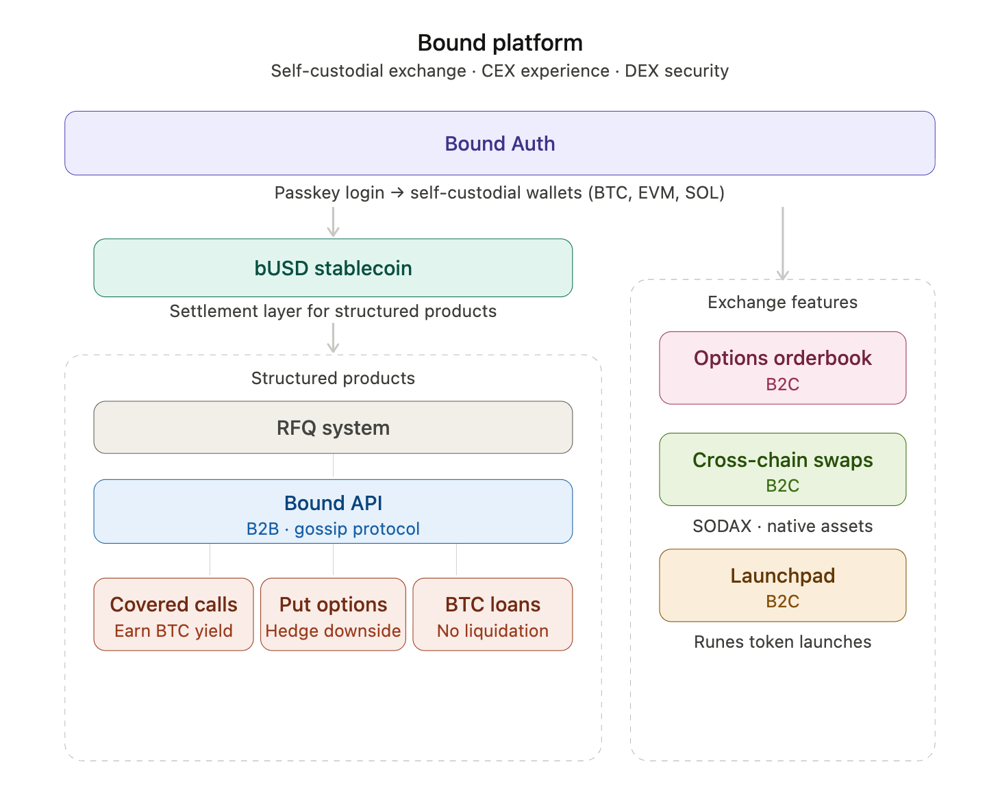

# Platform Overview

Bound is organized into three core layers, each building on the one below.

<figure><figcaption></figcaption></figure>

 

## Layer 1 - Infrastructure

* **Bound Auth** - Passkey-based authentication that creates self-custodial wallets across BTC, EVM, and Solana. All user-facing products require Bound Auth.
* **Bound APIs** - B2B API access layer for trading infrastructure and derivatives marketplace.

## Layer 2 - Trading Engine

* **Runes AMM** - Native Bitcoin token swaps and liquidity provisioning on Bitcoin mainnet.
* **SODAX Crosschain** -Native cross-chain swaps across BTC, ETH, SOL, USDC, and more - no wrapping, no bridging.

## Layer 3 - Products

* **Launchpad** - Token creation and launch via Virtual Mint. Uses Runes AMM for post-launch liquidity.
* **Lend / Borrow** -Liquidation-free loans and overcollateralized loans against BTC.
* **Derivatives (Options)** - Covered calls and put options for BTC yield and downside protection.

## bUSD - Settlement layer

bUSD is Bound's native Runes-based stablecoin on Bitcoin, backed 1:1 by other stablecoins. It acts as the settlement layer for all Bound structured products - every loan, option, and escrow settles in bUSD.
