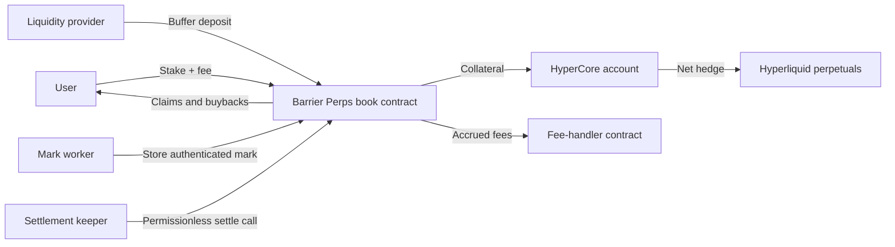

# Contract Architecture

Barrier Perps operate through isolated book contracts on HyperEVM. Each book contains its own assets, liabilities, positions, liquidity buffer, risk controls, and HyperCore hedge account.

## Components

## Book Contract

The book contract:

* Validates and prices quotes.
* Accepts user stakes and protocol fees.
* Stores barriers, payouts, owners, and lifecycle state.
* Maintains per-underlying net exposure.
* Posts and recalls HyperCore collateral.
* Adjusts Hyperliquid hedges.
* Accepts LP deposits and processes eligible withdrawals.
* Stores mark-worker readings.
* Settles positions and pays claims or buybacks.
* Enforces outflow limits and circuit breakers.

The contract is the counterparty of record to every user position in its book.

## HyperCore Account

Each book controls an isolated HyperCore account used for collateral and net hedging. User stakes and LP buffer capital may be posted there as hedge margin.

The account has one permitted off-HyperCore destination: its owning book contract. Every code path that recalls funds routes them back to the contract before any user, LP, or fee transfer occurs.

Transfers from the contract to HyperCore are unrestricted by the outflow limiter because they move funds toward the controlled hedge account rather than out of the system.

## Shared Outflow Allowance

Every transfer from the book contract consumes a shared allowance, including:

* Winner claims
* Early-close buybacks
* LP withdrawals
* Fee sweeps

Aggregate outflows within one window cannot exceed the configured share of `book_assets`. The check executes inside the transferring transaction, so one oversized transfer or many smaller transfers cannot exceed the same limit.

When the allowance is exhausted, affected transfers do not execute and buyback quoting pauses until capacity becomes available. Full allowance consumption is a monitoring condition.

## Fee-Handler Contract

Protocol fees accrue separately from the book's payout-backing assets. The book's `collectFees` function transfers accrued fees to a simple fee-handler contract, from which Bound can claim them.

Fee collection consumes the shared outflow allowance and stops during Freeze.

## Mark Worker

The mark worker periodically calls the book to store an authenticated HyperCore mark reading. The contract reads the precompile inside the transaction, so the publisher cannot supply a forged price.

Publishing is permissionless. Bound operates a reference implementation, but the protocol does not depend on Bound as the only publisher.

## Settlement Keeper

The settlement keeper watches active positions and calls `settlePosition` when it detects valid barrier evidence. The method is permissionless and safe to retry.

Bound operates a reference keeper to improve promptness, but any participant can submit a valid settlement call.

## Liquidity Providers

LPs deposit USDC buffer capital and receive shares of book NAV. They absorb hedge and cost variance and earn the spread through NAV growth.

LP access may be permissioned at launch. Deposits remain available during safety restrictions, while withdrawals are subject to NAV pricing, minimum-buffer requirements, outflow limits, and circuit breakers.

## Book Rotation

Each book has a `maxOI` cap measured as the sum of active user stakes. When a book reaches its cap:

* It stops accepting new opens.
* Existing positions remain active.
* Settlement, claims, and buybacks continue.
* Its open interest can only decline.

When all live books reach capacity, a fresh contract instance can be deployed. Isolation limits the assets and liabilities exposed to a fault, hedge failure, or exploit in any one book.
