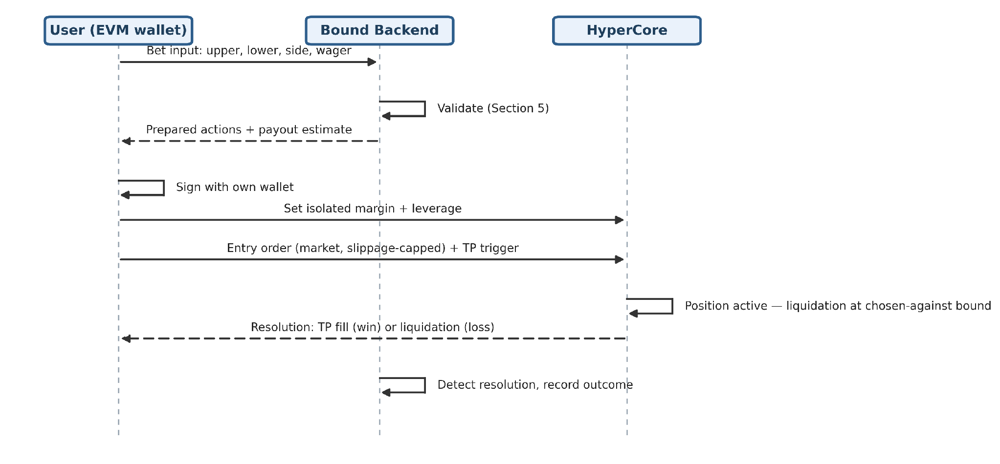

# How It Works

Creating a Binary Perp consists of five simple steps.

### 1. Define Your Prediction

Select an underlying asset and define two price levels:

* **Upper Price**
* **Lower Price**

Then choose which price level you believe will be reached first.

Finally, enter the amount of USDC you want to commit to the position.

***

### 2. Bound Constructs the Position

After validating the position parameters, Bound constructs an isolated perpetual position on Hyperliquid using your own account.

The selected price level becomes the position's take-profit, while the opposite price level determines the liquidation price.

The distance between the two price levels determines the leverage required to construct the position and the resulting payout if your prediction is correct.

***

### 3. Review & Sign

Before anything is submitted to the network, Bound prepares the required transactions for your review.

You retain full control of your account throughout the process:

* Every transaction requires your wallet signature.
* Bound never has custody of your assets.
* Bound cannot trade or move funds on your behalf.

Once you approve the transactions, the position is submitted to Hyperliquid.

***

### 4. Position Becomes Active

After the position is successfully opened, it remains active until one of the following occurs:

* Your selected price level is reached, closing the position in profit.
* The opposite price level is reached, resulting in liquidation.
* You choose to close the position early through a cash-out.
* The position is modified outside of Bound.

The current status of the position is continuously monitored and reflected within the application.

***

### 5. Position Resolves

Once the position closes, Bound records the outcome and displays the final result.

Possible outcomes include:

* **Won** – Your selected price level was reached first.
* **Lost** – The opposite price level was reached first.
* **Cashed Out** – You closed the position before either price level was reached.
* **Voided** – The position was modified outside of Bound, preventing it from being tracked as a Binary Perp.

***

### Architecture

The following sequence diagram illustrates the lifecycle of a Binary Perp, from position creation to settlement.

<figure><figcaption></figcaption></figure>
