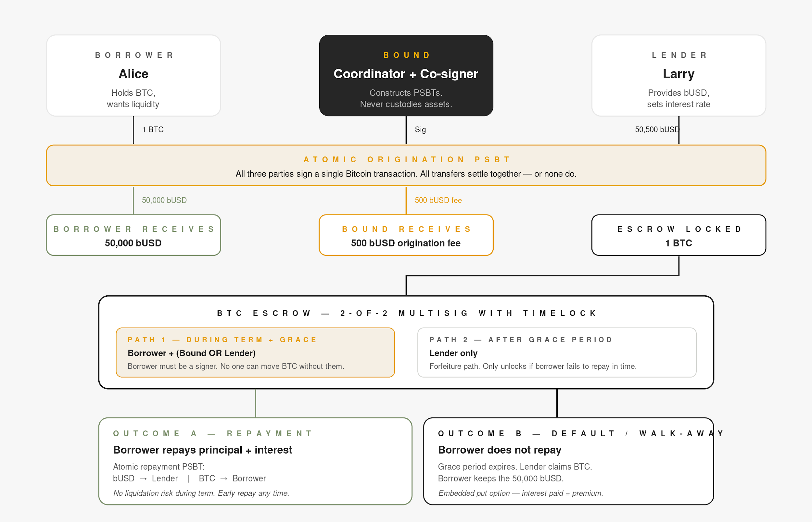

# Overview

Bound Borrow supports BTC-collateralized, fixed-rate term loans with no price-based liquidation.

A borrower locks BTC in a native Bitcoin multisig escrow and receives bUSD from a lender. BTC price movement does not affect the loan state. The borrower either repays principal plus interest during the term to reclaim the BTC, or does not repay and lets the lender claim the BTC after the grace period.

<figure><figcaption></figcaption></figure>

## Key properties

* **No price-based liquidation** - BTC price movement does not trigger liquidation.
* **Fixed term and fixed rate** - the repayment amount is known upfront.
* **Native Bitcoin collateral** - BTC remains in a Bitcoin multisig escrow. There is no wrapping, bridging, or custodial intermediary.
* **Self-custodial signing** - during the term, the escrowed BTC cannot be spent without the borrower's signature.
* **Atomic settlement** - origination and repayment each settle as a single Bitcoin transaction, so all legs complete together or none do.

## Participants

| Participant | Role |
| --- | --- |
| Borrower | Locks BTC collateral and receives bUSD liquidity |
| Lender | Provides bUSD and sets the loan interest rate |
| Bound | Coordinates PSBT construction and acts as a co-signer without taking custody |
