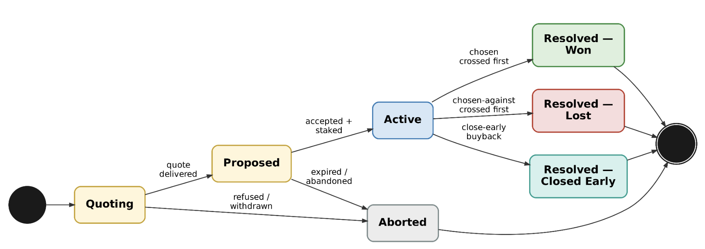

# Position Lifecycle

Every Boundary Perp follows a defined lifecycle from quote request through settlement or early close.

## Lifecycle States

| State | Description |
| --- | --- |
| **Quoting** | The request is being validated and priced. No funds or exposure exist. |
| **Proposed** | A quote has been delivered and is awaiting acceptance. No funds or exposure exist. |
| **Active** | The stake has been deposited, the payout and conditions are fixed, and the position is part of the hedged book. |
| **Resolved — Won** | The selected outcome occurred. The recorded payout is claimable under normal solvency conditions. |
| **Resolved — Lost** | The other outcome occurred. The stake was lost. |
| **Resolved — Closed Early** | The position owner accepted a buyback before a terminal outcome. |
| **Aborted** | The request was rejected, withdrawn, abandoned, or expired before opening. |

## State Transitions

<figure><figcaption>Boundary Perps position lifecycle</figcaption></figure>

## Before Opening

`Quoting` and `Proposed` do not represent live positions. No stake has transferred and no market exposure exists. An expired quote cannot be revived; a new quote must be requested using current conditions.

## While Active

An active position has fixed settlement conditions and a fixed winning payout. It remains active until:

* Its chosen outcome occurs.
* Its alternative outcome occurs.
* The owner accepts an early-close buyback.

## Terminal States

Won, lost, and closed-early positions are final. A winning position may remain unclaimed after settlement, but its outcome and payout do not change.
