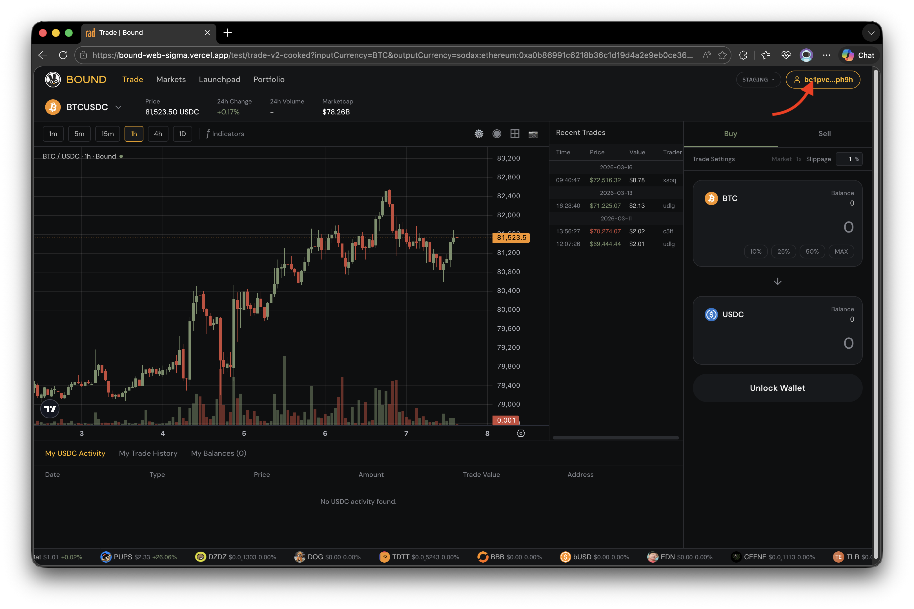
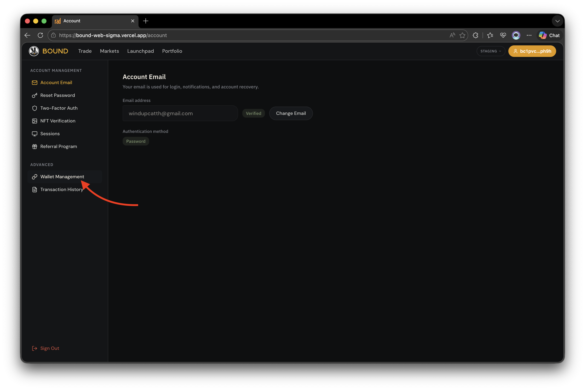
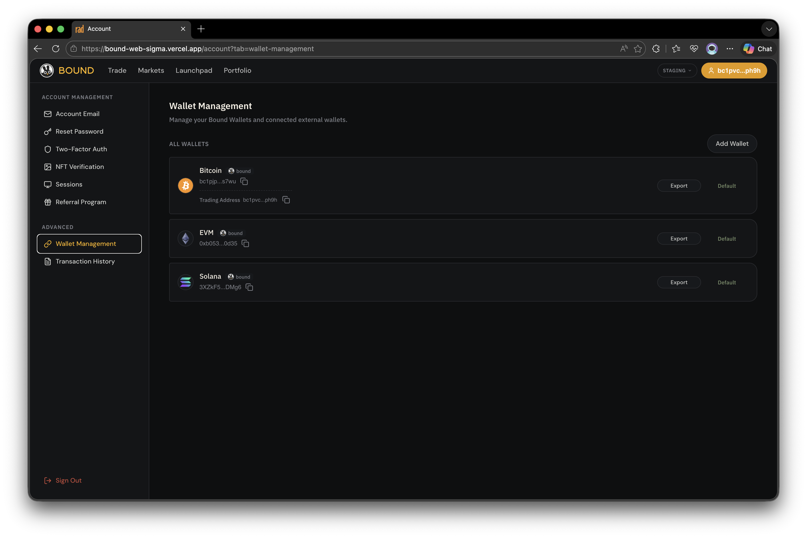
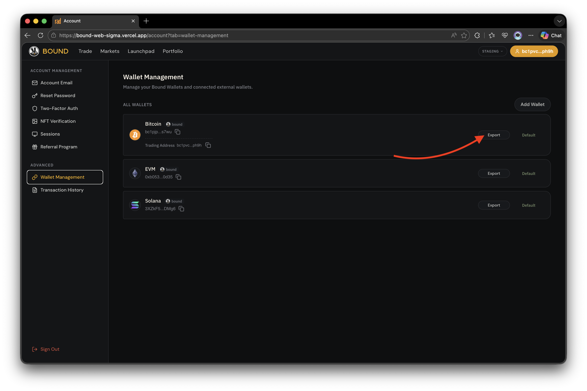
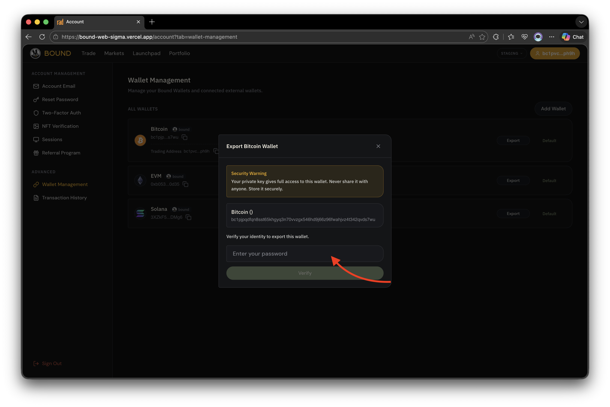
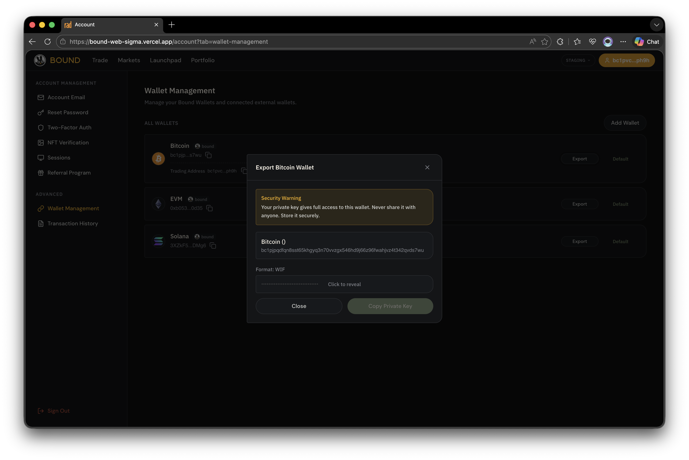
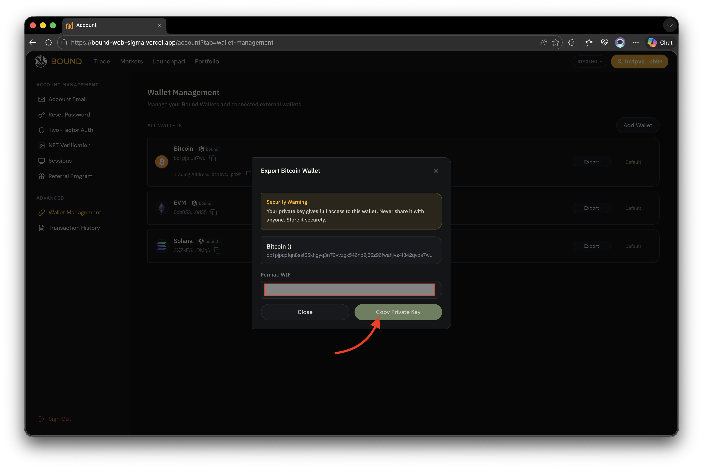

# Export Private Key

This guide shows how to export the private key of a Bound-generated wallet from the Bound app. Use this when you want to import your wallet into a third-party client (e.g. Sparrow, MetaMask, Phantom) or back it up offline.


Your private key gives full control over the funds in this wallet. Never share it and never paste it into untrusted websites. Bound will never ask you for your private key.


## Before you start

* You must be logged in to the Bound app.
* Only wallets with **provider = `bound`** can be exported. Imported / external wallets are managed by their original provider.
* Have your authentication method ready (passkey or account password).

## Step-by-step

### 1. Open Account

Log in to the Bound app and navigate to **Account**.

<figure><figcaption></figcaption></figure>

### 2. Go to Wallet Management

Inside Account, select the **Wallet Management** tab.

<figure><figcaption></figcaption></figure>

### 3. Locate a Bound wallet

In the **All Wallets** list, find the wallet whose **Provider** column shows `bound`.

<figure><figcaption></figcaption></figure>

### 4. Click Export

Click the **Export** button on that wallet row. The **Export \[Chain] Wallet** modal opens with a security warning.

<figure><figcaption></figcaption></figure>

### 5. Authenticate

Confirm your identity using the method linked to your account:

* **Passkey account** - click **Verify with Passkey** and approve on your device.
* **Password account** - enter your account password and click **Verify**.

<figure><figcaption></figcaption></figure>

### 6. App derives the private key

Once verified, the app derives and prepares the private key in the standard format for the wallet's chain:

| Chain   | Format            |
| ------- | ----------------- |
| Bitcoin | WIF               |
| EVM     | Hex Private Key   |
| Solana  | Base58 Secret Key |

### 7. Reveal the private key

The key is hidden by default. Click the **Click to reveal** area to display it.

<figure><figcaption></figcaption></figure>

### 8. Copy the private key

After it is revealed, click **Copy Private Key** to copy it to your clipboard. Paste it directly into your password manager or target wallet - do not leave it on the clipboard longer than necessary.

<figure><figcaption></figcaption></figure>

### 9. Close the modal

Click **Close** to dismiss the modal. The key is cleared from the UI.

## After export

* Import the key into your third-party wallet using the matching format above.
* Clear your clipboard once the key is safely stored.
* The exported wallet remains active in Bound - exporting does **not** remove or rotate the key.

## Troubleshooting

The Export button is disabled or missing

Only wallets created by Bound (provider = `bound`) can be exported. If the wallet was imported from an external source, manage it through its original provider. Check the **Provider** column in **All Wallets** to confirm.

Passkey verification fails

* Make sure you are on the same device (or a device synced via your platform passkey provider, e.g. iCloud Keychain, Google Password Manager) where the passkey was registered.
* Check that your browser supports WebAuthn and that passkeys are enabled at the OS level.
* Try again in a non-private/incognito window - some browsers block passkey prompts in private mode.

Password verification fails

* Confirm you are using the **account password**, not a wallet password from another app.
* If you have forgotten it, use the password reset flow from the login screen before retrying export.

The revealed key looks wrong for my wallet app

Check that the format matches what your target wallet expects:

* Bitcoin wallets usually accept **WIF** (starts with `K`, `L`, or `5`).
* EVM wallets (MetaMask, Rabby, ...) expect a **hex** string, 64 characters, optionally prefixed with `0x`.
* Solana wallets (Phantom, Solflare, ...) expect a **Base58** secret key.

If your wallet expects a different format (e.g. a 12/24-word seed phrase), it is **not** interchangeable with a single-account private key - import as "private key", not as "seed phrase".

I closed the modal before copying the key

Nothing is lost - simply repeat the flow from step 4. The key is re-derived locally each time and is never stored by Bound.

